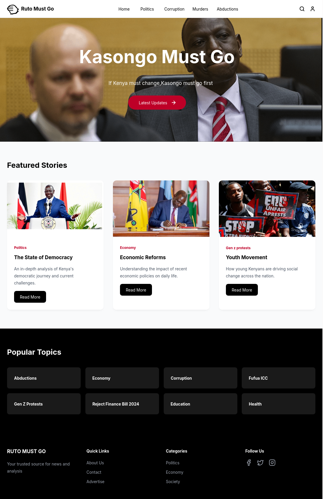

# Documentation for "_Kasongo Must Go_"

[DKTJONATHAN](https://github.com/DKTJONATHAN/Ruto-Must-Go), started the "Kaongo Must Go" project, but needed aid in developing the ack end structures. Herein is my chipping in to make it a success.

I Used PHP/Laravel (v 11.5) to develop the back end. Please feel free to fork, extend, and use as you will deem it fit.

# How to install
- Download the project files into a folder or use `git clone https://github.com/ObedNyakundi/kasongomustgo`.
- Open terminal in the project folder. In some Linux distros, you might need to grant permissions to the project. Do so with:
 ` sudo chmod -R 755 ./`
- Install project dependencies using:
 `composer install`
- Update the `.env` file or recreate it.
- Generate the application key:
 `php artisan key:generate`
- Run the database server (optional for those using sqlite)
- Run laravel server 
 `php artisan serve`
- Make database migrations.
 `php artisan migrate`
 

 ## Special Note:
 All files under `./documentation` and this `readme.md` can be safely deleted. 
 Also, all images in the folder `./public/images/cover_images` and `./public/images/post_attachments` can be safely deleted for the initial installation.

 **Have some fun!**

The sections below are for technical uses
# Conceptual Framework

## Database: Tables.

- [x] Responsibilities table.
- [x] Users table.
- [x] Posts table.
- [x] Categories table.
- [x] Comments table.

## Defining Relationships.

- [x] A **responsibility** has one or many **users.**
- [x] A **user** belongs to a **responsibility.**
- [x] A **user** has one or many **posts.**
- [x] A **user** has one or many **comment.**
- [x] A **post** belongs to a **user.**
- [x] A **category** has one or many **posts.**
- [x] A **post** belongs to a **category.**
- [x] A **post** has one or many **comments.**
- [x] A **comment** belongs to a **post.**
- [x] A **comment** belongs to a **user.**

### Initial Schema

# Admin Panel controls and views.

- [x] Landing Page blade layout view implementation.
- [x] Responsibility blade layout view implementation on Admin.
- [x] User blade layout view implementation on Admin.
- [x] Posts blade layout view implementation on Admin.
- [x] Category blade layout view implementation on Admin.
- [ ] Comment blade layout view implementation on Admin.

# Linking the frontend to the backend.

- [x] landing page controller.
- [x] Making the hero/featured section changeable.
- [x] displaying other featured posts.
- [x] displaying popular topics.

# Conclusion and Regards.
- [DKTJONATHAN](https://github.com/DKTJONATHAN)
- [Yours Truly...](https://github.com/ObedNyakundi)
