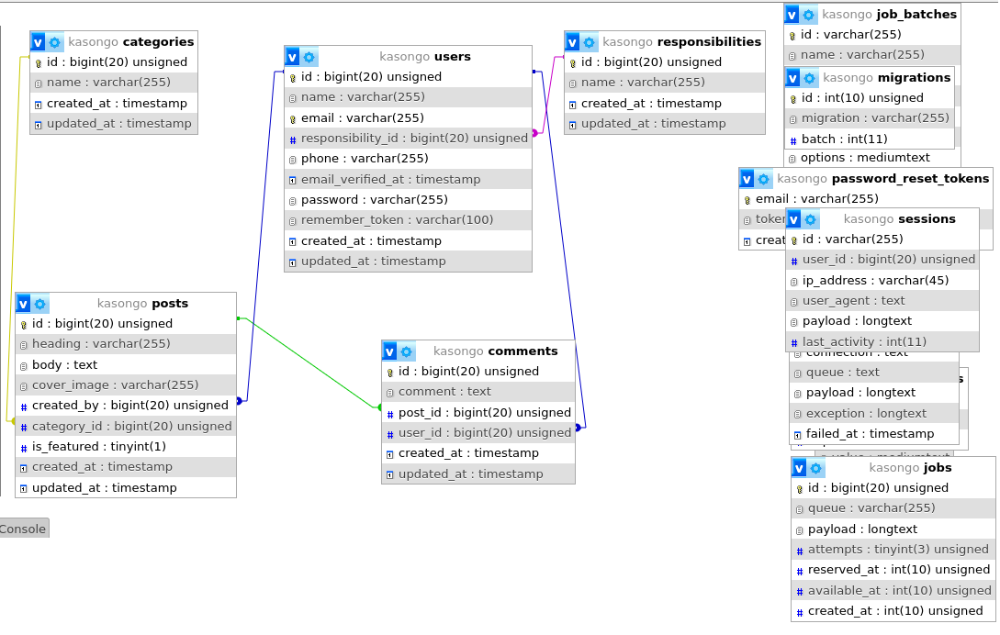

# Documentation for "_Kasongo Must Go_"

[DKTJONATHAN](https://github.com/DKTJONATHAN/Ruto-Must-Go), started the "Kaongo Must Go" project, but needed aid in developing the ack end structures. Herein is my chipping in to make it a success.

I Used PHP/Laravel (v 11.5) to develop the back end. Please feel free to fork, extend, and use as you will deem it fit.

# Conceptual Framework

## Database: Tables.

- [x] Responsibilities table.
- [x] Users table.
- [x] Posts table.
- [x] Categories table.
- [x] Comments table.

## Defining Relationships.

- [x] A **responsibility** has one or many **users.**
- [x] A **user** belongs to a **responsibility.**
- [x] A **user** has one or many **posts.**
- [x] A **user** has one or many **comment.**
- [x] A **post** belongs to a **user.**
- [x] A **category** has one or many **posts.**
- [x] A **post** belongs to a **category.**
- [x] A **post** has one or many **comments.**
- [x] A **comment** belongs to a **post.**
- [x] A **comment** belongs to a **user.**

### Initial Schema

# Admin Panel controls and views.

- [ ] Landing Page blade layout view implementation.
